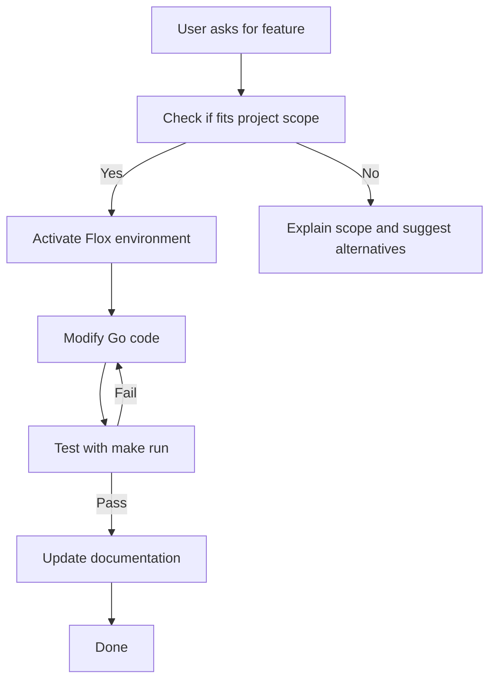

# CLAUDE.md - AI Assistant Guide for tf-cdk

This document helps AI assistants (like Claude) understand the project structure, development workflow, and how to effectively assist with this codebase.

## Project Overview

**Type:** Infrastructure as Code demonstration project
**Primary Language:** Go
**IaC Tools:** CDKTF (Cloud Development Kit for Terraform)
**Package Manager:** Flox (for reproducible development environments)
**Purpose:** Demonstrate JSON to Terraform conversion using Go + CDKTF

## Quick Start for AI Assistants

### Essential Context

1. **This is a Flox-managed project** - All commands should be run within the Flox environment
2. **Platform engineering pattern** - Developers write JSON, Go generates Terraform
3. **Uses both Node.js and Go** - See ARCHITECTURE.md for details on interplay
4. **All commands use cdktf CLI** - No direct Go execution commands

### First Steps When Assisting

```bash
# Always verify you're in the Flox environment
flox activate

# Check available tools
make version

# Generate Terraform from JSON
make synth
```

## Project Structure

```
tf-cdk/
├── config.json          # Developer input (JSON)
├── main.go              # Go app (reads JSON, generates Terraform)
├── go.mod / go.sum      # Go dependencies
├── cdktf.json           # cdktf CLI configuration
├── Makefile             # Build automation
├── README.md            # User-facing documentation
├── USAGE.md             # Detailed usage guide
├── ARCHITECTURE.md      # Technical architecture deep-dive
├── DEPLOYMENT.md        # Deployment guide
├── CLAUDE.md            # This file
├── .gitignore           # Git ignore patterns
├── .flox/               # Flox environment (managed)
└── cdktf.out/           # Generated Terraform (after synth)
```

## Development Environment

### Flox-Managed Dependencies

All tools are installed via Flox:

| Tool | Version | Purpose |
|------|---------|---------|
| Go | 1.25.2 | Main application language |
| Node.js | 22.20.0 | Required for CDKTF/CDK CLIs |
| Terraform | 1.13.4 | Infrastructure deployment engine |
| cdktf-cli | 0.21.0 | CDKTF command-line tool |
| aws-cdk | 2.1004.0 | AWS CDK command-line tool |

### Running Commands

**Always use Flox:**
```bash
# For direct commands
flox activate -- go run main.go

# Or activate first
flox activate
go run main.go
```

**Use the Makefile:**
```bash
make run      # Run the application
make build    # Build binary
make deps     # Update dependencies
make clean    # Clean artifacts
```

## Key Files Explained

### main.go (Primary Source)

**Structure:**
- **Lines 16-33:** `NewMyStack()` - CDKTF stack creation using Go constructs
- **Lines 36-65:** `RunCDKTFCommands()` - Demonstrates CDKTF CLI integration
- **Lines 68-98:** `RunAWSCDKCommands()` - Demonstrates AWS CDK CLI integration
- **Lines 101-115:** `RunTerraformCommands()` - Demonstrates Terraform CLI integration
- **Lines 118-130:** `CreateCDKTFApp()` - Creates CDKTF app programmatically
- **Lines 132-161:** `main()` - Orchestrates all demonstrations

**What it does:**
1. Checks if running in Flox environment
2. Executes various CLI commands to show tool integration
3. Creates a CDKTF stack using Go libraries (without synthesis)

**What it doesn't do:**
- Doesn't actually synthesize Terraform files (skips `app.Synth()`)
- Doesn't deploy real infrastructure
- Doesn't have full provider bindings

### cdktf.json (CDKTF Configuration)

Defines CDKTF project settings:
- Language: Go
- App command: `go run main.go`
- Providers: AWS (~> 5.0)

**Note:** This file would be used by `cdktf synth` in a real project.

### example-infrastructure.tf (Reference)

Shows what CDKTF _would_ generate:
- AWS provider configuration
- S3 bucket with versioning
- Random string for uniqueness
- Outputs

**Important:** This is a reference example, not generated code.

## Common Development Tasks

### Adding New Infrastructure Examples

When asked to add new infrastructure examples:

1. **For demonstration purposes (current approach):**
   ```go
   // Add to NewMyStack() in main.go
   fmt.Println("📦 Adding new resource...")
   // Describe the resource conceptually
   ```

2. **For real CDKTF (if evolving the project):**
   ```bash
   # Generate provider bindings first
   cdktf get

   # Then use generated types
   import "github.com/example/tf-cdk-demo/.gen/aws/..."
   ```

### Modifying CLI Demonstrations

Pattern used in main.go:
```go
commands := []struct {
    name        string
    cmd         string
    args        []string
    description string
}{
    {
        name:        "Display Name",
        cmd:         "command-name",
        args:        []string{"arg1", "arg2"},
        description: "What this does",
    },
}

for _, c := range commands {
    cmd := exec.Command(c.cmd, c.args...)
    output, err := cmd.CombinedOutput()
    // Handle output
}
```

To add new demonstrations, add to the `commands` slice.

### Updating Dependencies

```bash
# Update Go dependencies
make deps

# Or manually
go get -u
go mod tidy

# For CDKTF version updates
# Edit go.mod to match cdktf CLI version
# Check: cdktf --version
```

### Testing Changes

```bash
# Quick test
make run

# Build and test binary
make build
./tf-cdk-demo

# Verify Flox environment
make verify-tools
```

## Architecture Understanding

### Critical Concept: Node.js ↔ Go Interaction

See ARCHITECTURE.md for deep dive. TL;DR:

1. **Node.js CLIs** (cdktf, cdk) are orchestration tools
2. **Go code** defines infrastructure type-safely
3. **Interplay happens via:**
   - Shell execution (Go calls Node.js CLI)
   - Process spawning (Node.js CLI runs Go code)
   - JSON serialization (Go outputs, Node.js processes)
   - Code generation (Node.js generates Go bindings)

### Why This Matters

When helping with this project:
- Go compilation errors = check Go dependencies
- CLI command errors = check Node.js tools available
- Type errors with CDKTF = may need to regenerate bindings with `cdktf get`
- Synthesis issues = involves both runtimes

## Common Issues and Solutions

### "command not found: go/node/cdktf/etc"

**Problem:** Not in Flox environment
**Solution:**
```bash
flox activate
```

### "declared and not used" in Go

**Problem:** Go requires all variables to be used
**Solution:** Use variables or remove them (see commit f58e1a0 for example)

### "cannot find package" for CDKTF

**Problem:** Go modules not downloaded
**Solution:**
```bash
make deps
# or
go mod download
```

### CDKTF version mismatch

**Problem:** CLI version ≠ Go library version
**Solution:**
```bash
cdktf --version  # Check CLI
# Edit go.mod to match version
go mod tidy
```

## Extending the Project

### To Make It Production-Ready

1. **Initialize real CDKTF project:**
   ```bash
   cdktf init --template=go --local
   ```

2. **Generate provider bindings:**
   ```bash
   cdktf get
   ```

3. **Use generated types:**
   ```go
   import "github.com/yourproject/.gen/aws/s3"

   s3.NewS3Bucket(stack, jsii.String("id"), &s3.S3BucketConfig{
       Bucket: jsii.String("name"),
   })
   ```

4. **Synthesize:**
   ```go
   app.Synth()  // Enable this in CreateCDKTFApp()
   ```

5. **Deploy:**
   ```bash
   cdktf deploy
   ```

### To Add More Demonstrations

Pattern to follow:

1. Add new function (e.g., `RunDockerCommands()`)
2. Follow existing pattern with `commands` slice
3. Add call in `main()`
4. Update README.md with description

## AI Assistant Best Practices

### When Modifying Code

1. **Read existing patterns first:**
   ```bash
   # Look at how commands are structured
   grep -A 10 "commands := \[\]struct" main.go
   ```

2. **Test after changes:**
   ```bash
   make run
   ```

3. **Update documentation:**
   - Update README.md for user-facing changes
   - Update ARCHITECTURE.md for architectural changes
   - Update this file for workflow changes

### When Explaining the Project

**Focus on:**
- It's a demonstration/educational project
- Shows integration patterns, not production deployment
- Demonstrates both CLI and library usage
- Managed by Flox for reproducibility

**Clarify:**
- This doesn't deploy real infrastructure
- It's a starting point for learning CDKTF
- Real projects would use `cdktf get` to generate bindings

### When Debugging

**Check in order:**
1. Is Flox environment active?
2. Are all tools available? (`make verify-tools`)
3. Are Go dependencies up to date? (`make deps`)
4. Does code compile? (`go build`)
5. What's the actual error message?

### When Suggesting Improvements

**Good suggestions:**
- Add more CLI demonstrations
- Show additional CDKTF patterns
- Improve documentation
- Add error handling examples
- Show testing strategies

**Avoid suggesting:**
- Actual cloud deployment (out of scope)
- Removing Flox (it's a project requirement)
- Production-level error handling (it's a demo)
- Complex multi-stack scenarios (keep it simple)

## Resources

**For understanding the project:**
- README.md - User documentation
- ARCHITECTURE.md - Technical deep-dive
- example-infrastructure.tf - Terraform reference

**For CDKTF:**
- [CDKTF Documentation](https://developer.hashicorp.com/terraform/cdktf)
- [CDKTF Go API](https://pkg.go.dev/github.com/hashicorp/terraform-cdk-go/cdktf)

**For AWS CDK:**
- [AWS CDK Documentation](https://docs.aws.amazon.com/cdk/)

**For Flox:**
- [Flox Documentation](https://flox.dev/docs)

## Development Workflow

### Typical Task Flow



### Code Change Checklist

- [ ] Flox environment active
- [ ] Code compiles (`go build`)
- [ ] Application runs (`make run`)
- [ ] No unused variables/imports (Go requirement)
- [ ] README.md updated if user-facing changes
- [ ] ARCHITECTURE.md updated if architectural changes
- [ ] CLAUDE.md updated if workflow changes

## Meta: About This File

**Purpose:** Help AI assistants quickly understand and work with this project

**When to update:**
- New patterns added to codebase
- Common issues encountered
- Project scope changes
- Development workflow changes
- New tools/dependencies added

**This file is for AI assistants, but:**
- Developers can read it too
- It complements, not replaces, README.md
- It should stay practical and actionable

---

**Last Updated:** 2025-11-20
**Project Version:** 1.0 (Initial toy demonstration)
**Flox Environment:** Active and managed in `.flox/`
